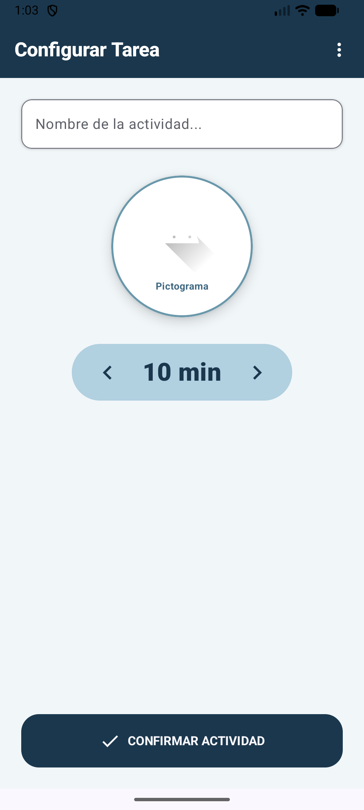
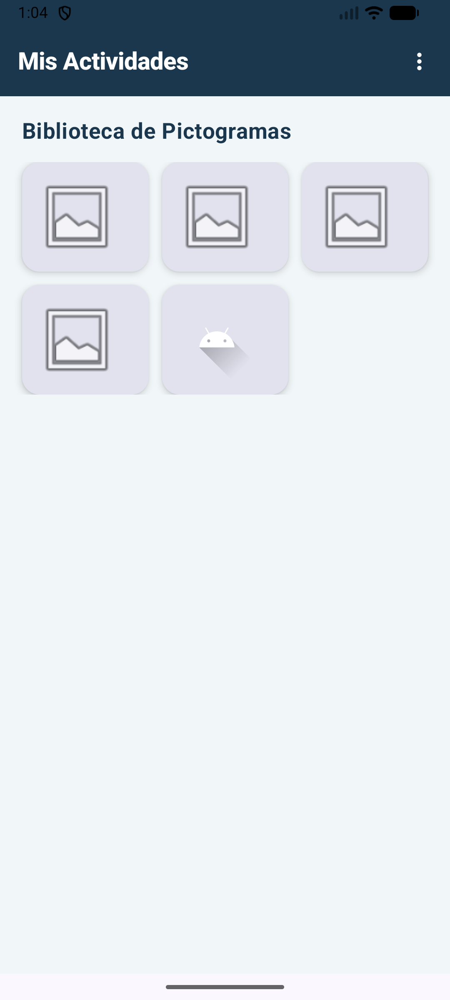
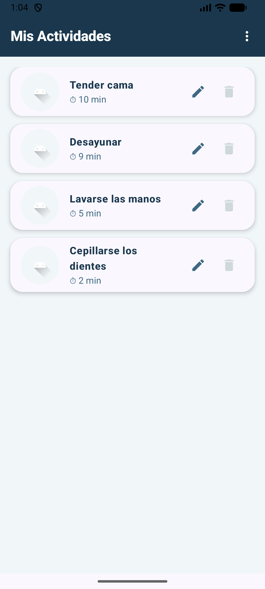

🚀 Editor de Tareas - Laboratorio 7 (Ejercicio 2)

📝 Descripción del Proyecto
Este proyecto corresponde al Ejercicio 2 del Laboratorio 7, enfocado en la implementación de persistencia de datos local y diseño de interfaz de usuario moderna. La aplicación permite gestionar rutinas diarias mediante un sistema CRUD completo, diseñado específicamente para facilitar la organización de actividades con apoyo visual (pictogramas).

✨ Características Principales
CRUD Local: Persistencia robusta utilizando Room Database.
Selector de Pictogramas: Biblioteca integrada para asignar imágenes visuales a cada tarea.
Diseño UX/UI: Interfaz en tonos fríos (Azul Glaciar y Gris Pizarra) para reducir la carga cognitiva.
Gestión de Tiempos: Selector dinámico de duración para cada actividad.
Navegación Eficiente: Menú contextual (Overflow menu) para alternar entre edición y visualización.

🛠️ Tecnologías Utilizadas
Lenguaje: Kotlin
UI: Jetpack Compose (Material 3)
Base de Datos: Room Persistence Library
Arquitectura: Manejo de estados con remember y mutableStateOf.
Gestión de Dependencias: Gradle 8.9 (Wrapper) y AGP 8.7.2.

📸 Capturas de Pantalla

| Editor de Tareas | Biblioteca ARASAAC | Lista de Actividades |
| :---: | :---: | :---: |
|  |  |  |
